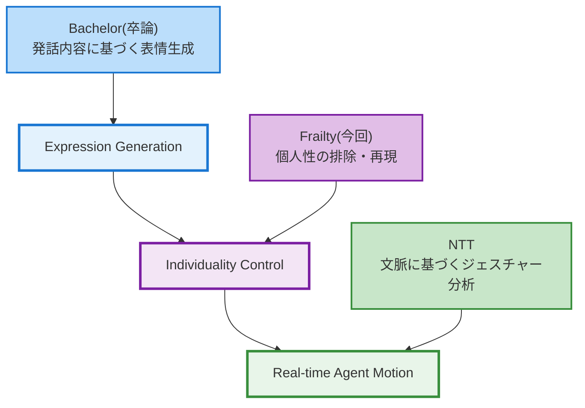
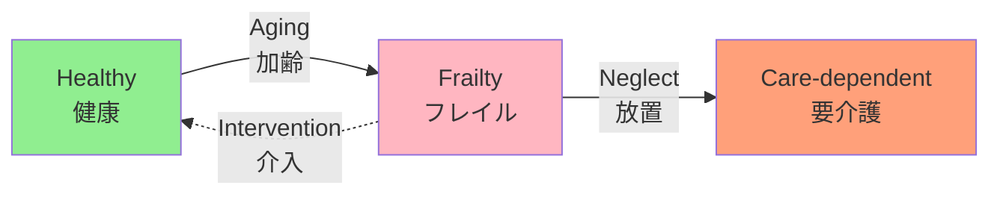
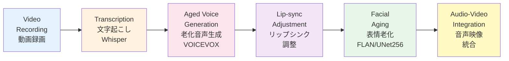
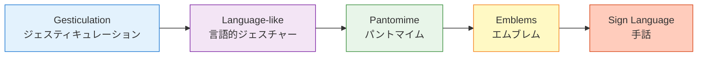

# Development of Frailty Experience System

フレイル体験システムの開発

Multimodal Aging Simulation through Voice and Facial Features

音声・表情の老化特徴統合による予防啓発アプローチ

  
    Press Space for next page <carbon:arrow-right class="inline"/>
  

---
layout: default
---

Master's Thesis Roadmap

---
layout: default
---

# Background: What is Frailty?

<v-clicks>

- **Frailty (虚弱)**: Intermediate state between healthy aging and requiring care
  
健康な老化と要介護状態の中間段階

- Age-related decline in physiological reserves → Increased vulnerability
  
加齢に伴う予備能力の低下 → ストレスに対する脆弱性の増加

- **Key point: Reversible with appropriate intervention**
  
重要：適切な介入により可逆的に改善可能

</v-clicks>

<v-click>

<a href="https://www.jpn-geriat-soc.or.jp/publications/other/pdf/review_51_6_497.pdf" target="_blank">荒井秀典. "フレイルの意義." 日老医誌 51.6 (2014): 497-501.</a>

</v-click>

---
layout: default
---

# Purpose of This Research

本研究の目的

<v-clicks>

- **Challenge**: Frailty is "a distant future" for young people
  
課題：若年層にとってフレイルは「遠い未来の話」

- **Approach**: Awareness through experience - making it personal
  
アプローチ：体験を通じた気づきにより、自分ごととして捉えてもらう

- **Goal**: Simulating future self to promote preventive behaviors
  
目標：将来の自分の姿を疑似体験することで予防行動を促進

</v-clicks>

<v-click>

### ✅ This System IS

- Experience-based awareness tool
  
体験型の啓発ツール

- Motivating healthy behaviors
  
健康行動への動機づけ

### ❌ This System is NOT

- NOT a diagnostic system
  
診断システムではない

- Does not predict individual risk
  
個人のリスク予測はしない

</v-click>

---
layout: default
---

# System Approach

システムアプローチ

## Multimodal Aging Simulation

マルチモーダルな老化シミュレーション

### 🎤 Voice Aging

音声老化

<v-click>

**Bruno's Research**

Brunoさんの研究

- VOICEVOX synthesis
  
VOICEVOX音声合成

- Reduced speech rate
  
話速の低下

- Lower pitch/intonation
  
ピッチ・抑揚の低下

</v-click>

### 👴 Facial Aging

表情老化

<v-click>

**FLAN Implementation**

FLAN実装

- UNet256 model
  
UNet256モデル

- MediaPipe detection
  
MediaPipe顔検出

- Wrinkle generation
  
しわ・たるみ生成

</v-click>

### 🎬 Integration

統合

<v-click>

**Our Contribution**

本研究の貢献

- Audio-visual fusion
  
音声・映像融合

- Offline pipeline
  
オフライン処理

- Lip-sync adjustment
  
リップシンク調整

</v-click>

<v-click>

**Concept**: Combining voice and facial aging for realistic, immersive experience

コンセプト：音声老化と表情老化を組み合わせ、リアルで没入感のある体験を実現

</v-click>

---
layout: default
---

# Processing Pipeline

処理パイプライン

<v-click>

### Input

入力

- User records short video (5-10 sec)
  
ユーザーが短い動画を録画（5-10秒）

- Speaking naturally to camera
  
カメラに向かって自然に話す

### Output

出力

- Aged video with synchronized audio
  
音声同期された老化動画

- Realistic aging features (voice + face)
  
リアルな老化特徴（音声+顔）

</v-click>

---
layout: default
---

## Before (Original)

元動画

  <video src="/before.mov" controls class="w-full rounded-lg border-2 border-gray-400"></video>

<v-click>

- Young voice & facial expressions
  
若年層の声・表情

- Natural speech rate
  
自然な話速

- Smooth facial changes
  
滑らかな表情変化

</v-click>

## After (Aged)

老化処理後

  <video src="/after.mp4" controls class="w-full rounded-lg border-2 border-gray-400"></video>

<v-click>

- Elderly voice (lower, slower)
  
老人的な声（低い・ゆっくり）

- Wrinkles and sagging
  
しわ・たるみのある表情

- Lip-sync adjusted
  
リップシンク調整済み

</v-click>

---
layout: default
---

# Future Work

今後の課題

<v-clicks>

## 1. Lip-sync Refinement

1. リップシンクの精緻化

- **Challenge**: Different speaker speeds between original and aged voice
  
課題：元音声と老化音声で話者速度が異なる

- Current: Simple speech region detection + speed adjustment
  
現在：シンプルな有声区間検出+速度調整

- Future: Word-level lip-sync mapping for better accuracy
  
今後：単語レベルのリップシンクマッピングでより高精度に

## 2. Real-time Processing

2. リアルタイム処理

- Current: Offline video pipeline (~1-2 min processing time)
  
現在：オフライン動画処理（処理時間1-2分程度）

- Future: Integration with Bruno's real-time system + real-time face aging
  
今後：Brunoさんのリアルタイムシステム統合+リアルタイム顔老化

</v-clicks>

---
layout: default
---

# Future Work

今後の課題

<v-clicks>

## 3. User Study & Evaluation

3. ユーザー評価

- Measure awareness improvement before/after experience
  
体験前後での意識変化の測定

</v-clicks>

---
layout: default
---

# Gesture Classification Framework

ジェスチャー分類の理論的枠組み

<v-clicks>

## Kendon's Continuum

Kendonの連続体

身体動作が言語的性質を帯びる度合いによる連続体 (Kendon, 2004)

</v-clicks>

<v-click>

**分析の課題**: 言語的性質が低いほど、解析が困難になる

Gesticulation（左側）は発話との関係が曖昧で、文脈依存的な分析が必要

</v-click>

---
layout: default
---

# McNeill's Classification of Gestures

McNeillのジェスチャー分類

### Iconic

アイコニック

<v-click>

- Depicts physical form or action
  
物体や動作の形状を模写

- Example: Tracing spiral for "spiral staircase"
  
例：「螺旋階段」で螺旋を描く

</v-click>

### Metaphoric

メタフォリック

<v-click>

- Abstract concepts as physical forms
  
抽象概念を物理的形状で表現

- Example: Timeline gesture (left to right)
  
例：時間の流れ（左→右）

</v-click>

### Deictic

デイクティック

<v-click>

- Pointing to objects or locations
  
対象物や方向への指差し

- Resolves references ("that", "there")
  
指示代名詞の内容を確定

</v-click>

### Beat

ビート

<v-click>

- Rhythmic movements with speech
  
発話のリズムに合わせた動き

- Emphasizes discourse structure
  
談話構造の強調

</v-click>

<v-click>

**Growth Point Theory** (McNeill, 2005): Gesture and speech emerge simultaneously from the same mental representation

成長点理論：ジェスチャーと発話は同一の思考単位から同時に分化する

**Synchrony Rules**: Gesture stroke synchronizes with pitch accent, shares semantic/pragmatic function with speech

同期規則：ストロークは強勢音節と同期し、発話と意味・語用論的機能を共有

</v-click>

---
layout: default
---

<v-clicks>

**Context-Gesture Disconnection**

文脈とジェスチャーの紐付け困難

- Existing methods analyze gestures in isolation
  
既存手法はジェスチャーを単独で分析

- Cannot capture relationship with dialogue context
  
対話文脈との関係性を捉えられない

**Temporal Motion Analysis Gap**

時系列モーション分析の欠如

- Pose analysis methods exist
  
ポーズ分析手法は存在する

- No established methods for temporal motion sequences
  
時系列モーションデータの分析手法は未確立

</v-clicks>

<v-click>

## Our Objective

本研究の目的

**Develop a model that bridges context and motion, enabling systematic gesture analysis**

文脈とモーションを紐付けるモデルを構築し、体系的なジェスチャー分析を可能にする

</v-click>

---
layout: center
class: text-center
---

Thank you for your attention

ご清聴ありがとうございました

Questions?

質問はありますか？

